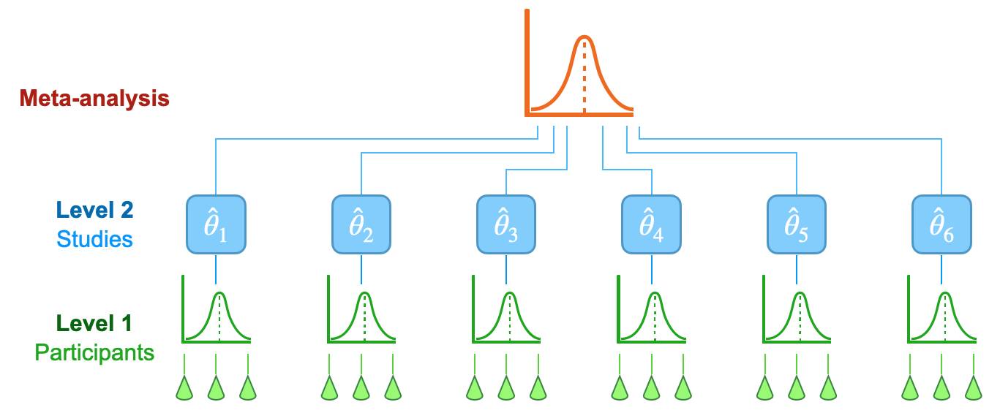
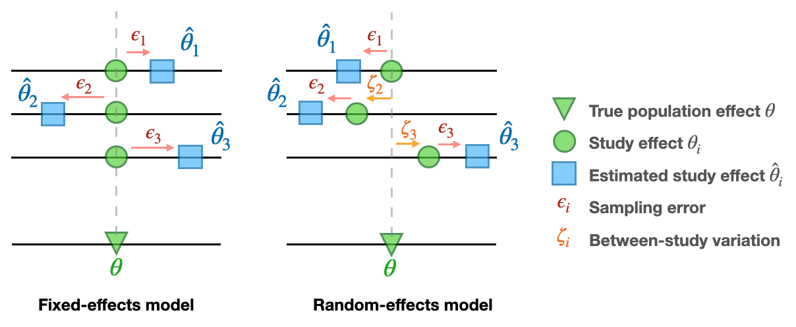

# MetaR2M: A novel meta-analysis framework for high-dimensional $R^2$-based mediation effect

## Get started

## Introduction
### Meta-analysis
Meta-analysis is used to aggregate the effects of interest across multiple studies, while its methodology is largely underexplored in mediation analysis, particularly in estimating the total mediation effect of high-dimensional omics mediators.

 

### Fixed/Random-effects model
Fixed-effects models require the assumption that the true effects of interest are identical across all studies or cohorts. Random-effects models are used when there is heterogeneity across the studies included in the meta-analysis.

 
