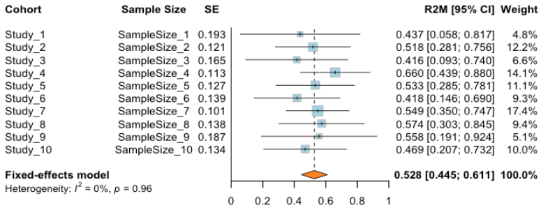
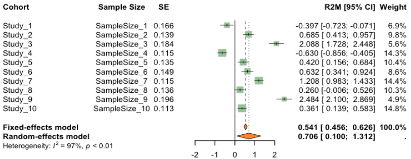

# MetaR2M: A novel meta-analysis framework for high-dimensional $R^2$-based mediation effect

This package presents a groundbreaking framework for conducting meta-analyses in high-dimensional settings, specifically for evaluating the R2-based total mediation effect. This innovative tool supports both fixed-effects and random-effects models, accommodating various research designs and high-throughput technologies. It is uniquely designed to handle the complexities inherent in high-dimensional data, a common feature in contemporary biomedical research.

> [!IMPORTANT]  
> For the simulation settings and computational details for the paper, please refer to [MetaR2M-paper](https://github.com/zhichaoxu04/MetaR2M). Here we only provide the R package.

# Introduction
### Meta-analysis
Meta-analysis is a statistical technique used to combine the results of multiple studies to arrive at a comprehensive understanding of a particular field or topic. This method is especially prevalent in fields like medicine, psychology, and social sciences, where individual studies might have varying outcomes or small sample sizes. By aggregating data from several studies, a meta-analysis can provide more robust conclusions, identify patterns, and offer insights that might not be apparent from individual studies. 
<div align="center"></div>
</br>

### Fixed/Random-effects model
Fixed-effects models require the assumption that the true effects of interest are identical across all studies or cohorts. Random-effects models are used when there is heterogeneity across the studies included in the meta-analysis. In meta-analysis, the choice between a fixed-effect and a random-effects model is fundamental and depends on the underlying assumptions about the nature of the effects being analyzed.

The fixed-effect model operates under the assumption that there is one true effect size that is common to all the studies being analyzed. In essence, it posits that any observed differences in effect sizes across studies are solely due to sampling error. This model is particularly appropriate when the meta-analysis includes studies that are highly similar in terms of participants, interventions, and outcomes, suggesting that they are all tapping into the same underlying effect. The key advantage of this model is its simplicity and increased statistical power due to the assumption of a single underlying effect. However, its major limitation is that it cannot account for variability beyond chance among different studies, which can lead to biased results if this assumption is violated.

On the other hand, the random-effects model acknowledges and accommodates heterogeneity in effect sizes across studies. This model assumes that the studies in the meta-analysis are estimating different, yet related, effect sizes. These differences could arise from variations in study populations, methodologies, or other contextual factors. The random-effects model includes both within-study sampling error and between-study variance in its calculations. This approach is more flexible and realistic in scenarios where study heterogeneity is expected. It provides a more generalized conclusion, applicable to a broader context beyond the specific studies included in the meta-analysis. The trade-off, however, is that this model often has less statistical power compared to the fixed-effect model due to the additional variance component that needs to be estimated.

<div align="center"></div>
</br>

### $Q$ statistic for heterogeneity
The $Q$ statistic is a key measure in meta-analysis, primarily used to test for heterogeneity among the included studies. It is calculated as the weighted sum of squared differences between individual study effects and the overall effect estimate, where the weights are typically the inverse of each study's variance. The underlying principle of the $Q$ statistic is to determine whether the observed differences in study outcomes are greater than what would be expected by chance alone. Under the null hypothesis, which assumes homogeneity among the study effects (i.e., any differences are due to sampling error), the $Q$ statistic follows a chi-square distribution with degrees of freedom equal to the number of studies minus one. A significant $Q$ (usually indicated by a p-value less than a conventional threshold like 0.05) suggests the presence of heterogeneity, meaning that the variation in study results cannot be fully attributed to random chance. However,  $Q$'s power to detect heterogeneity depends on several factors, including the number of studies and their size. Due to this, $Q$ is often complemented with other measures, such as the $I^2$ statistic, which quantifies the proportion of total variation in study estimates due to heterogeneity.

# Get started
### Download and install:

- Download [MetaR2M](https://github.com/zhichaoxu04/MetaR2M) package from Github using:

<!-- -->

    git clone https://github.com/zhichaoxu04/MetaR2M.git

- Or, install [MetaR2M](https://github.com/zhichaoxu04/MetaR2M) package in R directly

  - First, install [devtools](https://devtools.r-lib.org) in R from CRAN:
    ``` r
    install.packages("devtools")
    ```
  - Then, install [MetaR2M](https://github.com/zhichaoxu04/MetaR2M) using the `install_github` function and load the package:
    ``` r
    devtools::install_github("zhichaoxu04/MetaR2M")
    library(MetaR2M)
    ```
- Make sure that all the required packages have been installed or updated. Here are some of the required packages:
  - [RsqMed](https://cran.r-project.org/web/packages/RsqMed/index.html): An implementation of calculating the R-squared measure as a total mediation effect size measure and its confidence interval for moderate- or high-dimensional mediator models. It gives an option to filter out non-mediators using variable selection methods. The original R package is directly related to the paper [Yang et al (2021)](https://pubmed.ncbi.nlm.nih.gov/34425752/). The new version contains a choice of using cross-fitting, which is computationally faster. The details of the cross-fitting method are available in our paper [Xu et al (2023)](https://www.ncbi.nlm.nih.gov/pmc/articles/PMC9934518/).
  - [SIS](https://cran.r-project.org/web/packages/SIS/index.html): Variable selection techniques are essential tools for model selection and estimation in high-dimensional statistical models. Through this publicly available package, they provide a unified environment to carry out variable selection using iterative sure independence screening (SIS) ([Fan and Lv (2008)](https://academic.oup.com/jrsssb/article/70/5/849/7109492)) and all of its variants in generalized linear models ([Fan and Song (2009)](https://projecteuclid.org/journals/annals-of-statistics/volume-38/issue-6/Sure-independence-screening-in-generalized-linear-models-with-NP-dimensionality/10.1214/10-AOS798.full)) and the Cox proportional hazards model ([Fan, Feng and Wu (2010)](https://projecteuclid.org/ebooks/institute-of-mathematical-statistics-collections/Borrowing-Strength--Theory-Powering-Applications--A-Festschrift-for/chapter/High-dimensional-variable-selection-for-Coxs-proportional-hazards-model/10.1214/10-IMSCOLL606)).
  - [HDMT](https://cran.r-project.org/web/packages/HDMT/index.html): A multiple-testing procedure for high-dimensional mediation hypotheses. Mediation analysis is of rising interest in epidemiology and clinical trials. Methods used in the package refer to [James Y. Dai, Janet L. Stanford & Michael LeBlanc (2020)](https://www.tandfonline.com/doi/full/10.1080/01621459.2020.1765785).
  - [dplyr](https://cran.r-project.org/web/packages/dplyr/index.html): A Grammar of Data Manipulation: a fast, consistent tool for working with data frame like objects, both in memory and out of memory.
  - [meta](https://cran.r-project.org/web/packages/meta/index.html): User-friendly general package providing standard methods for meta-analysis and supporting Schwarzer, Carpenter, and Rücker, ["Meta-Analysis with R" (2015)](https://link.springer.com/book/10.1007/978-3-319-21416-0).

### Toy Example
Let’s suppose we aim to perform a meta-analysis using data from four distinct cohorts within a substantial genetic database. Our goal is to assess the mediating impact of gene expression on the age-related
variations observed in systolic blood pressure (BP). For illustrative purposes, we will utilize the example data preloaded in our package as a representative sample for this analysis.

The outcome Y will be the systolic BP generated from a normal distribution with mean 100 and standard error 15. The exposure X will be the age generate from a normal distribution with mean 60 with standard error 10.

```r
    # Install the package
    devtools::install_github("zhichaoxu04/MetaR2M")

    # Load the dataset in the package
    library(MetaR2M)
    library(dplyr)
    data("exampleData")

    # Check the data structure
    # Column names
    colnames(exampleData$study1)[1:5]

    ## [1] "Y"   "X"   "M_1" "M_2" "M_3"

    # Dimension
    dim(exampleData$study1)

    ## [1] 300  52

    # Summary stats
    summary(exampleData$study1$Y)

    ##    Min. 1st Qu.  Median    Mean 3rd Qu.    Max. 
    ##   63.74   89.80  100.15  100.21  111.13  140.70

    summary(exampleData$study1$X)

    ##    Min. 1st Qu.  Median    Mean 3rd Qu.    Max. 
    ##   34.01   51.52   58.38   59.05   65.78   95.68
```

```r
    # Use the first study to run CF-OLS to get the R2M
    Y <- exampleData$study1$Y
    M <- exampleData$study1 %>% dplyr::select(dplyr::starts_with("M_"))
    X<- exampleData$study1$X
    result1 <- CF_OLS(Y=Y, M=M, X=X, FDR=FALSE)
    result1$output

    ##           R2M            SE      CI_width      CI_lower      CI_upper 
    ##   0.003080464   0.005478429   0.010737523  -0.007657059   0.013817987 
    ##            p1            p2          R_YX          R_YM         R_YXM 
    ##  41.000000000  47.000000000  -0.002965571   0.286975494   0.292285665 
    ##           SOS  SOS_CI_lower  SOS_CI_upper          Time    SampleSize 
    ##   0.367131245  -1.000468122   1.734730612   0.014590967 300.000000000 
    ##       NumMeds 
    ##  50.000000000
```

This outcome suggests that there are no mediating effects between age and systolic blood pressure via the 50 simulated mediators, as evidenced by the inclusion of 0 in the confidence interval. This is a logical,finding, considering that these variables were simulated from independent distributions. By replicating this process, we can obtain an estimate of R2M and its standard error, which then allows us to advance to the meta-analysis of R2M.

Assume we have obtained R2M estimates from 10 independent studies. Initially, we simulated these effects using a normal distribution, with a mean of 0.5 and a standard error of 0.1. We also generated the corresponding standard errors from a uniform distribution ranging between 0.1 and 0.2. In this scenario, we conducted both fixed-effects and random-effects meta-analyses. The results indicate, based on the heterogeneity test, that the fixed-effects model is more appropriate. The meta-analysis provided an estimate of 0.5276, with a confidence interval ranging from 0.4447 to 0.6106.

```r
    set.seed(1)
    Study1 <- rep(1:10)
    Effects1 <- stats::rnorm(10, 0.5, 0.1)
    SE1 <- stats::runif(10, 0.1, 0.2)

    Method <- "Fixed"
    MetaR2M::R2_Meta(Effects=Effects1, Study=Study1, SE=SE1, Method=Method)
    ##   meta_effect meta_CI_lower meta_CI_upper             Q        Q_pval 
    ##      "0.5276"      "0.4447"      "0.6106"       "3.047"      "0.9624" 
    ##        Method 
    ##       "Fixed"
```

After that, we attempt to increase the variation among the 10 estimates by raising the standard error to 1 in its sampling distribution. The results show that we should opt for the random-effects model. In this model, the meta-analysis estimate is 0.7042, with a confidence interval ranging from 0.1698 to 1.2386.

```r
    set.seed(2)
    Study2 <- rep(1:10)
    Effects2 <- stats::rnorm(10, 0.5, 1)
    SE2 <- stats::runif(10, 0.1, 0.2)
    Method <- "Fixed"
    MetaR2M::R2_Meta(Effects=Effects2, Study=Study2, SE=SE2, Method=Method)

    ## p value of Q is <= 0.05, try random-effects model

    ##   meta_effect meta_CI_lower meta_CI_upper             Q        Q_pval 
    ##       "0.541"      "0.4557"      "0.6263"    "347.2221"           "0" 
    ##        Method 
    ##       "Fixed"

    Method <- "DL"
    MetaR2M::R2_Meta(Effects=Effects2, Study=Study2, SE=SE2, Method=Method)

    ##   meta_effect meta_CI_lower meta_CI_upper             Q        Q_pval 
    ##      "0.7042"      "0.1698"      "1.2386"    "347.2221"           "0" 
    ##        Method 
    ##          "DL"
```

### Visualization

The `forest.meta` function in the `meta` package of R is a powerful tool for meta-analysis, providing a comprehensive way to visualize the results of meta-analytical studies. This function creates a forest plot, a graphical display designed to illustrate the relative strength of treatment effects in multiple quantitative scientific studies addressing the same question.
```r
    library(meta)
    # Construct a dataframe to plot
    data_to_plot1 <- data.frame(
      cohort = paste0("Study_", 1:10),
      SampleSize = paste0("SampleSize_", 1:10),
      effect_size = Effects1,             
      se = SE1
    )

    res <- meta::metagen(TE=effect_size, seTE=se, studlab=cohort, data=data_to_plot1, random = F)
    print(res)

    ## Number of studies: k = 10
    ## 
    ##                                      95%-CI     z  p-value
    ## Common effect model 0.5276 [0.4447; 0.6106] 12.47 < 0.0001
    ## 
    ## Quantifying heterogeneity:
    ##  tau^2 = 0 [0.0000; 0.0021]; tau = 0 [0.0000; 0.0461]
    ##  I^2 = 0.0% [0.0%; 62.4%]; H = 1.00 [1.00; 1.63]
    ## 
    ## Test of heterogeneity:
    ##     Q d.f. p-value
    ##  3.05    9  0.9624
    ## 
    ## Details on meta-analytical method:
    ## - Inverse variance method
    ## - Restricted maximum-likelihood estimator for tau^2
    ## - Q-Profile method for confidence interval of tau^2 and tau

    meta::forest(res, leftcols = c("studlab", "SampleSize", "se"),
                 leftlabs = c("Cohort", "Sample Size", "SE"),
                 rightcols = c("effect.ci", "w.fixed"), rightlabs = c("R2M [95% CI]", "Weight"),
                 prediction = F, method.tau = "HE", digits = 3,
                 print.tau2 = FALSE,xlim = c(0, 1), 
                 col.square = c("#ADD8E6"), col.diamond = c("#FF8C00"), text.common = "Fixed-effects model",
                 text.random = "Random-effects model",
                 text.w.common = "Fixed",
                 text.w.random = "Random")
```

<div align="center"></div>
</br>

```r
    library(meta)
    # Construct a dataframe to plot
    data_to_plot1 <- data.frame(
      cohort = paste0("Study_", 1:10),
      SampleSize = paste0("SampleSize_", 1:10),
      effect_size = Effects2,             
      se = SE2
    )

    res <- meta::metagen(TE=effect_size, seTE=se, studlab=cohort, data=data_to_plot1, random = T)
    print(res)

    ## Number of studies: k = 10
    ## 
    ##                                       95%-CI     z  p-value
    ## Common effect model  0.5410 [0.4557; 0.6263] 12.43 < 0.0001
    ## Random effects model 0.7057 [0.0998; 1.3116]  2.28   0.0224
    ## 
    ## Quantifying heterogeneity:
    ##  tau^2 = 0.9341 [0.4302; 3.2046]; tau = 0.9665 [0.6559; 1.7901]
    ##  I^2 = 97.4% [96.4%; 98.1%]; H = 6.21 [5.29; 7.30]
    ## 
    ## Test of heterogeneity:
    ##       Q d.f.  p-value
    ##  347.22    9 < 0.0001
    ## 
    ## Details on meta-analytical method:
    ## - Inverse variance method
    ## - Restricted maximum-likelihood estimator for tau^2
    ## - Q-Profile method for confidence interval of tau^2 and tau

    meta::forest(res, leftcols = c("studlab", "SampleSize", "se"),
                 leftlabs = c("Cohort", "Sample Size", "SE"),
                 rightcols = c("effect.ci", "w.fixed"), rightlabs = c("R2M [95% CI]", "Weight"),
                 prediction = F, method.tau = "HE", digits = 3,
                 print.tau2 = FALSE,
                 col.square = c("#9BCD9B"), col.diamond = c("#FF8C00"), text.common = "Fixed-effects model",
                 text.random = "Random-effects model",
                 text.w.common = "Fixed",
                 text.w.random = "Random")
```

<div align="center"></div>
</br>

### Some tips for visualization:

-   Versatile Data Representation: It allows the user to represent the data from meta-analyses, including effect sizes, confidence intervals, and levels of statistical significance.

-   Customizable Plots: forest.meta offers extensive customization options, such as modifying the size and color of the plot markers, adjusting text labels, and choosing between fixed or random effects models.

-   Heterogeneity Insights: The function provides a visual understanding of the heterogeneity among the study results, which is crucial for interpreting meta-analysis findings.

-   Inclusion of Summary Measure: It can include a pooled estimate of the overall effect size, enhancing the comprehension of the overall analysis impact.

-   User-Friendly Interface: Designed to be accessible for both novice and advanced R users, facilitating a range of meta-analytical research needs.


# Notes:

The MetaR2M package is built upon the foundations of the [meta](https://cran.r-project.org/web/packages/meta/index.html) and [SIS](https://cran.r-project.org/web/packages/SIS/index.html). We extend our heartfelt gratitude to the authors of these packages for their invaluable contributions. Questions or novel applications? Contact information
can be found in the [Github](https://github.com/zhichaoxu04).
