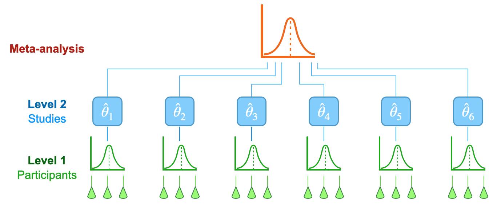

# MetaR2M: A novel meta-analysis framework for high-dimensional $R^2$-based mediation effect

# Introduction
## Meta-analysis
Meta-analysis is a statistical technique used to combine the results of multiple studies to arrive at a comprehensive understanding of a particular field or topic. This method is especially prevalent in fields like medicine, psychology, and social sciences, where individual studies might have varying outcomes or small sample sizes. By aggregating data from several studies, a meta-analysis can provide more robust conclusions, identify patterns, and offer insights that might not be apparent from individual studies. 
<div align="center"></div>
</br>

## Fixed/Random-effects model
Fixed-effects models require the assumption that the true effects of interest are identical across all studies or cohorts. Random-effects models are used when there is heterogeneity across the studies included in the meta-analysis. In meta-analysis, the choice between a fixed-effect and a random-effects model is fundamental and depends on the underlying assumptions about the nature of the effects being analyzed.

The fixed-effect model operates under the assumption that there is one true effect size that is common to all the studies being analyzed. In essence, it posits that any observed differences in effect sizes across studies are solely due to sampling error. This model is particularly appropriate when the meta-analysis includes studies that are highly similar in terms of participants, interventions, and outcomes, suggesting that they are all tapping into the same underlying effect. The key advantage of this model is its simplicity and increased statistical power due to the assumption of a single underlying effect. However, its major limitation is that it cannot account for variability beyond chance among different studies, which can lead to biased results if this assumption is violated.

On the other hand, the random-effects model acknowledges and accommodates heterogeneity in effect sizes across studies. This model assumes that the studies in the meta-analysis are estimating different, yet related, effect sizes. These differences could arise from variations in study populations, methodologies, or other contextual factors. The random-effects model includes both within-study sampling error and between-study variance in its calculations. This approach is more flexible and realistic in scenarios where study heterogeneity is expected. It provides a more generalized conclusion, applicable to a broader context beyond the specific studies included in the meta-analysis. The trade-off, however, is that this model often has less statistical power compared to the fixed-effect model due to the additional variance component that needs to be estimated.

<div align="center"></div>
</br>

## $Q$ statistic for heterogeneity
The $Q$ statistic is a key measure in meta-analysis, primarily used to test for heterogeneity among the included studies. It is calculated as the weighted sum of squared differences between individual study effects and the overall effect estimate, where the weights are typically the inverse of each study's variance. The underlying principle of the $Q$ statistic is to determine whether the observed differences in study outcomes are greater than what would be expected by chance alone. Under the null hypothesis, which assumes homogeneity among the study effects (i.e., any differences are due to sampling error), the $Q$ statistic follows a chi-square distribution with degrees of freedom equal to the number of studies minus one. A significant $Q$ (usually indicated by a p-value less than a conventional threshold like 0.05) suggests the presence of heterogeneity, meaning that the variation in study results cannot be fully attributed to random chance. However,  $Q$'s power to detect heterogeneity depends on several factors, including the number of studies and their size. Due to this, $Q$ is often complemented with other measures, such as the $I^2$ statistic, which quantifies the proportion of total variation in study estimates due to heterogeneity.

# Get started
Download and install following required R packages:

- Download [MetaR2M](https://github.com/zhichaoxu04/MetaR2M) package from Github using:

<!-- -->

    git clone https://github.com/zhichaoxu04/crSKAT.git

- Or, install [MetaR2M](https://github.com/zhichaoxu04/MetaR2M) package in R directly

  - First, install [devtools](https://devtools.r-lib.org) in R from CRAN:
    ``` r
    install.packages("devtools")
    ```
  - Then, install [MetaR2M](https://github.com/zhichaoxu04/MetaR2M) using the `install_github` function and load the package:
    ``` r
    devtools::install_github("zhichaoxu04/MetaR2M")
    library(MetaR2M)
    ```
- Make sure that all the required packages have been installed or updated. Here are some of the required packages:
  - [CompQuadForm](https://cran.r-project.org/web/packages/CompQuadForm/index.html):
    Compute the distribution function of quadratic forms in normal
    variables using Imhof’s method, Davies’s algorithm, Farebrother’s
    algorithm or Liu et al.’s algorithm.
  - [nleqslv](https://cran.r-project.org/web/packages/nleqslv/index.html):
    Solves a system of nonlinear equations using a Broyden or a Newton
    method with a choice of global strategies such as line search and
    trust region.
  - [ICSKAT](https://cran.r-project.org/web/packages/ICSKAT/index.html):
    Implements the Interval-Censored Sequence Kernel Association
    (ICSKAT) test for testing the association between interval-censored
    time-to-event outcomes and groups of single nucleotide polymorphisms
    (SNPs).
  - [bindata](https://cran.r-project.org/web/packages/bindata/index.html):
    Generates correlated artificial binary data.

## Toy Example

Let’s assume our objective is to study the possible association between
a specific gene and the time taken for a fracture to occur. In this
context, death acts as the competing risk. To delve into this premise,
we’ll simulate event times for 5,000 subjects based on a proportional
hazards model. Observations will be scheduled at four distinct times: 4,
11, 18, and 25. Each participant’s precise observation time will be
determined by a random draw from a Uniform(-0.25, 0.25) distribution
centered around these predefined times. Furthermore, there’s a 10%
chance for any participant to miss a scheduled visit.

The genetic dataset will include information on 50 single nucleotide
polymorphisms (SNPs) related to the gene in question. For every patient,
their minor allele count, which can be 0, 1, or 2, is documented for
each of these 50 SNPs. Alongside the genetic data, we also possess
details on non-genetic covariates: one being categorical and the other
one continuous.

