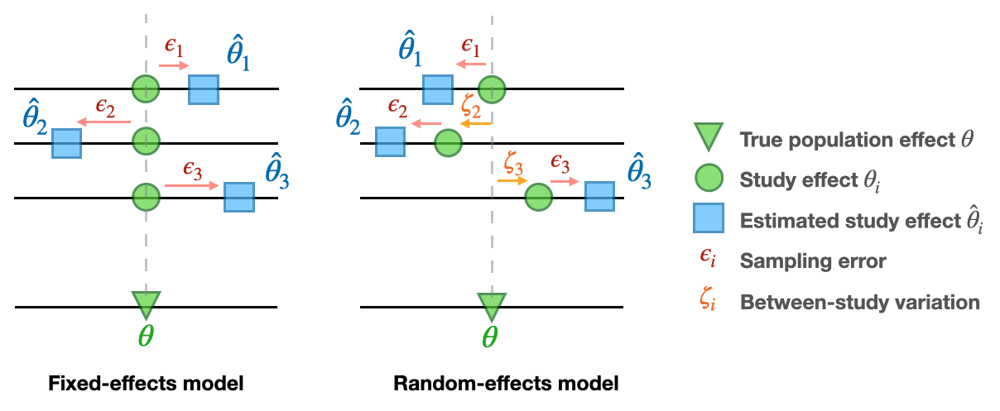

# MetaR2M: A novel meta-analysis framework for high-dimensional $R^2$-based mediation effect

## Get started

## Introduction
### Meta-analysis
Meta-analysis is a statistical technique used to combine the results of multiple studies to arrive at a comprehensive understanding of a particular field or topic. This method is especially prevalent in fields like medicine, psychology, and social sciences, where individual studies might have varying outcomes or small sample sizes. By aggregating data from several studies, a meta-analysis can provide more robust conclusions, identify patterns, and offer insights that might not be apparent from individual studies. 

 

### Fixed/Random-effects model
Fixed-effects models require the assumption that the true effects of interest are identical across all studies or cohorts. Random-effects models are used when there is heterogeneity across the studies included in the meta-analysis.

 
